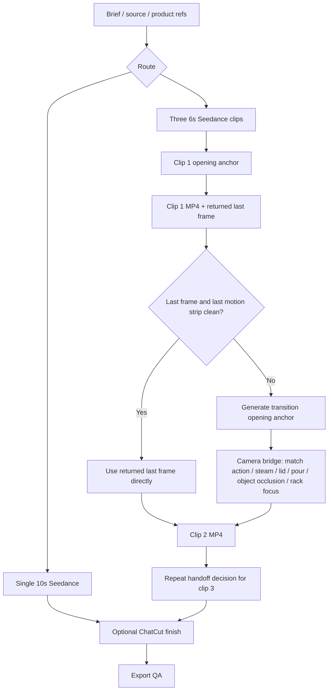

---
tags:
  - moc
  - video
  - seedance
  - workflow-map
aliases:
  - Video Production Map
  - Seedance Relationship Map
updated: 2026-07-30
---

# Video Production Map

Use this as the relationship map for original product/cooking videos. It
connects the production contract, provider memory, visual taste, and ChatCut
handoff without duplicating the full workflow.

## Source Of Truth

The active production contract is
[[viral-social-remix/references/cooking-video-workflow|Cooking Video Workflow]].
If this note, old memory, or provider research conflicts with that file, update
the memory and follow the contract.

## Decision Graph

## Core Rule

For the three-clip route, never use a bad returned last frame literally. Inspect
the final motion strip and last frame:

- clean endpoint: use it as the next clip's only opening reference;
- weak, blurry, malformed, or awkward endpoint: generate a transition opening
  anchor with the image model, then use that anchor as the next clip's only
  reference;
- no honest bridge possible: retry the prior clip.

The transition anchor is a camera bridge, not a generic replacement still. It
must name match action, steam/lid/pour/object occlusion, plate movement, rack
focus, texture insert, or another motivated transition.

## Related Notes

- Runtime contract: [[viral-social-remix/SKILL]]
- Production workflow: [[viral-social-remix/references/cooking-video-workflow]]
- Provider handoff: [[viral-social-remix/references/seedance-video]]
- Prompting memory: [[seedance-official-prompting]]
- Prompt optimizer distillation: [[seedance-prompt-optimizer]]
- Cost and QA memory: [[seedance-video-generation]]
- Original cooking summary: [[original-cooking-video]]
- Visual taste: [[aesthetic-library/no-face-asian-cooking-style]]
- ChatCut finish: [[chatcut-handoff-workflow]]
- ChatCut memory hub: [[chatcut/README]]

## Asset Boundary

Generation references stay out of ChatCut: opening anchors, returned last
frames, transition anchors, product/package/logo references, contact sheets,
and QA strips. ChatCut receives only accepted MP4 clips plus requested BGM,
voiceover, and editable post-production text.
